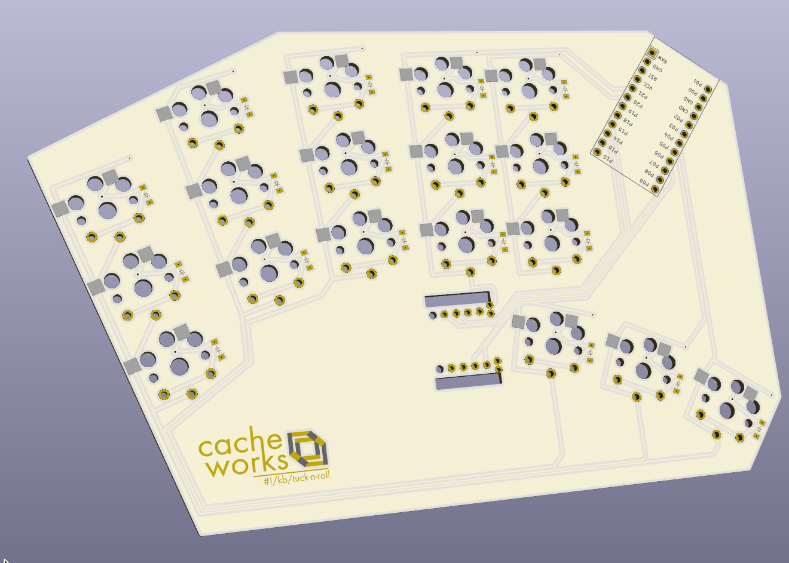

# !#/kb/

A collection of keyboards I'm working on, generated using [Ergogen](https://github.com/mrzealot/ergogen)

### - [tuck-n-roll](./tuck-n-roll)
`36 key keyboard with two tucky thumb encoders`

